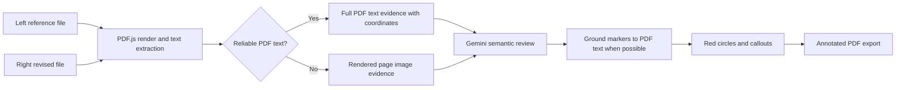

# LE PDF Scan

[English](README.en.md) | [ภาษาไทย](README.md)

LE PDF Scan is an internal document-review tool for comparing two PDF documents or images. The current web application is focused on **Document Compare**. It runs in the browser, can optionally ask Gemini to review business-content changes, and exports one annotated PDF for follow-up work.

This README is written as a handoff guide. Read the **Current Status** section before changing code: the repository still contains a separate OpenCV Priority Count system, but that system is intentionally hidden from the current web UI.

## Current Status

| Workstream | Status | Where it runs | Main code |
| --- | --- | --- | --- |
| Document Compare | Active in the web UI | Browser + direct Gemini API call using the user's saved key | `src/documentCompare.js`, `src/pdfTextDiff.js`, `src/gemini.js` |
| Gemini semantic review | Required to compare documents | Browser calls Gemini directly with the key entered by that user; no server proxy or build-time key | `src/gemini.js` |
| Priority Count / colored-marker scan | Paused and not shown in the UI | Separate Python/FastAPI service | `src/priorityScan.js`, `server_scanner.py`, `scripts/` |

`src/main.js` imports only `createDocumentCompare(...)`. That is why the public page currently opens directly to Document Compare and no longer shows Priority Scan.

> `"private": true` in `package.json` only prevents accidental publishing to npm. It does **not** control whether the GitHub repository is private or public.

## What A User Does Today

1. Upload a **ต้นฉบับ** (reference) file on the left and an **ฉบับเปรียบเทียบ** (revised) file on the right. Supported inputs are PDF, PNG, JPG, and WEBP.
2. Select the pages to compare. All pages are selected initially. Click thumbnails, Shift-click a range, or enter a range such as `1,5-8`.
3. Set a comparison area for each document page if only part of a page matters. Each side has its own page picker, `< >` navigation, and eight crop handles. The copy button applies the current crop only to the selected pages of that same document. On touch devices, the preview starts in scroll mode: tap the Crop button on the relevant side before editing. The touch hit areas are larger than the visible handles, and the adjacent reset button stays disabled until a custom crop exists.
4. Choose **สแกนเฉพาะสาระสำคัญ** or **สแกนทั้งหมด** from the compact selector in the Document Compare header. Focused mode exposes an editable Thai policy prompt, and that user prompt becomes the primary scope. The all-content mode keeps its all-differences policy locked; the same field becomes optional document context used only to explain document roles, field mappings, terminology, units, or equivalent formats. The focused prompt and exhaustive context are stored separately and never overwrite each other.
5. Click **Gemini** in the top-right header, enter an API key in the dialog, and save it. It is masked and stored in that browser's `localStorage`; the key is not written to the repository or sent to this app's server.
6. Review the list of differences and the annotated preview. Click **ดาวน์โหลด** to get one combined PDF containing the revised/right-hand pages in the selected comparison order.
7. Use the bottom dock inside the Document Compare workspace to edit the Prompt, start a comparison, and download results while the document area remains scrollable. The dock has a constrained width on desktop and uses the available width on narrow screens. It is layered over the same workspace as the document, so the document remains visible beside it.

While processing, the Prompt header becomes the progress display for the current page pair and the reset Prompt button becomes an X cancel action. The arrow expands or collapses the existing Prompt field inline instead of opening a separate window. Download progress is displayed separately from comparison progress.

## How Document Compare Works



### 1. Open and render input files

`src/documentCompare.js` uses PDF.js locally in the browser. PDF files are not uploaded to a Python scanner for Document Compare.

- PDF pages are rendered to canvases for previews and image fallback.
- For a PDF, PDF.js also exposes a text layer with each text fragment's coordinates.
- Images are treated as one-page documents and do not have an extractable PDF text layer.

### 2. Page pairing

The tool pairs only the pages the user selected:

- If the same number of pages is selected on both sides, it pairs them in order.
- If one side has one selected page, that page is compared with every selected page on the other side.
- Otherwise, the shorter selection is distributed in document order across the longer selection. This makes every selected page participate instead of silently dropping pages.

### 3. Comparison area (crop)

The crop region is stored separately by side and page. A crop on `ต้นฉบับ หน้า 2` never changes the crop on `ฉบับเปรียบเทียบ หน้า 2` or another page.

- Click or tap the Crop button for that document first. Crop editing is explicit on both desktop and touch devices, so clicking the preview while the button is inactive cannot create a new crop.
- Drag an empty area to create a crop.
- Drag inside an existing crop to move it.
- Use all eight handles: four corners and four edge midpoints.
- On touch devices, scroll normally without starting a crop. Tap the Crop button to enter edit mode, then tap the same button again to finish.
- The reset button next to Crop returns the active page to the full-page region and is disabled when no custom crop exists.
- The dashed full-page region means no custom crop is applied.

The crop is used for comparison only. It does not alter the source document or the final PDF page size.

### 4. Text-first comparison

For PDFs with a reliable text layer, `src/pdfTextDiff.js` extracts the complete readable text in the selected area and sends it to Gemini with normalized coordinates. It is evidence, not a precomputed answer.

The code:

- keeps only readable text fragments and rejects obvious mojibake so broken Thai encoding does not become authoritative;
- groups fragments into readable lines with stable normalized coordinates;
- sends both sides' complete text evidence to Gemini without sending a locally guessed difference list; and
- can locate Gemini's confirmed comparison text back on the revised/right-hand PDF for accurate circles.

This is why text PDFs should be compared through their text layer instead of trying to infer individual characters from pixels.

### 5. Image fallback

When reliable PDF text is not available, the app still sends rendered page images to Gemini. The image is the primary evidence for scanned PDFs and image files.

Gemini is instructed to ignore layout, scan skew, compression artifacts, and broad visual structure unless those visual elements are business content. The result remains semantic rather than a raw pixel-difference list.

### 6. Gemini scan

Gemini is the primary semantic detector. It is intended for comparison when two documents have different layouts but represent the same business content, for example a quotation versus a purchase order.

`src/gemini.js` sends the selected reference and revised areas to `gemini-3.1-flash-lite` together with complete extracted text evidence when available. In `focused` mode, the user-editable Thai prompt is the primary policy for what to inspect, include, ignore, and treat as material. In `exhaustive` mode, the application always sends the locked all-differences policy; optional user text is placed in a separate `USER DOCUMENT CONTEXT` block and may help match meaning but cannot narrow the scan or suppress evidence-backed changes. When a crop exists, both the image and text evidence are restricted to that crop, the prompt explicitly marks it as the hard scan boundary, and final marker boxes are clipped to it. Fixed instructions still enforce evidence-only answers, document prompt-injection isolation, valid JSON, and grounded coordinates. Gemini returns a clean Thai summary and grouped changes containing reference/revised values.

The normal path makes **one Gemini request per page pair**. Images, PDF text evidence, and bounded text candidates are assembled once, and the same request performs matching, materiality review, deduplication, and final self-review. The request runs in `src/geminiWorker.js`, so the browser UI can be left in another tab while the current comparison continues. A second request is made only as a malformed-JSON recovery retry. Gemini and network latency can still vary; closing or reloading the page still cancels a browser-owned job.

Because the app sends one pair at a time, it does not send the whole PDF in one Gemini request. The practical number of pages depends on the Google API quota, processing time, image payload size, and browser memory. For very large documents, select and review page ranges in smaller batches.

Gemini decides **what changed**. Marker placement uses the most reliable location available:

1. If the PDF text layer contains a matching reference/revised change, the app grounds the Gemini finding to that exact right-hand PDF text box.
2. If the matching text cannot be found, such as a scanned image or a non-extractable field, it falls back to Gemini's estimated image box.

This hybrid approach keeps Gemini's broader semantic coverage without letting approximate image coordinates shift circles away from the real text. The implementation is in `groundGeminiBoxesToPdfText(...)` in `src/documentCompare.js`.

### 7. Results and fullscreen preview

The results view includes every selected page pair, including pairs with no detected difference. Select a row to inspect its annotated preview.

- Fullscreen preview temporarily hides the bottom dock so the document and controls have more room.
- At `100%`, the page is fitted within both the available width and height so the whole document is visible.
- The preview supports zoom out, reset, zoom in, and scrolling when the page is larger than the viewport.
- Fullscreen controls include an exit action on both desktop and mobile.

### 8. Red circles, descriptions, and PDF export

Each confirmed finding is drawn as a red ellipse with a numbered badge. The corresponding explanation is placed back on the PDF page with a leader line.

Callout placement is deliberate, not random. The renderer samples ink density from the page image, avoids red-marker areas, avoids previously placed callouts, and scores candidate positions around the finding and across the page. It therefore prefers open/white areas. It is still a visual heuristic: on a dense page with no empty area large enough for a card, it chooses the least crowded valid position.

The export process uses `pdf-lib`:

- it copies the original revised/right-hand PDF pages at their original dimensions;
- it draws a transparent PNG annotation layer on top;
- it preserves the underlying document content for later editing; and
- it exports one combined `document-comparison.pdf` for all compared page pairs.

## Priority Count: Present in the Repository, Paused in the Web UI

Priority Count was built to rank PDF pages by the number of colored priority markers. It is **not deleted**. It is intentionally paused because it needs a long-running Python/OpenCV service and is not part of the current Vercel-only Document Compare release.

### What the priority system does

1. `server_scanner.py` receives a PDF and creates a background job.
2. `scripts/apply_red_box_calibration.py` renders pages with `pypdfium2` and asks `scripts/detector_features.py` to calculate OpenCV detector features.
3. The detector measures color-mask, connected-component, marker-area, and related page features for the requested color.
4. `model/detector_count_estimator.joblib` predicts a count from detector features. The current supported colors are red, green, blue, pink, and orange marker.
5. The service sorts pages by predicted count and produces a sorted PDF plus CSV.

### Source truth and calibration

`countedvalues.txt` is the human-counted source-truth dataset used during calibration. It covers the historical page range `1019-1115` (97 pages). It is training/evaluation data, not a page-number answer lookup.

The production scan path uses detector features and the tree-ensemble estimator in `model/detector_count_estimator.joblib`. The scanner code explicitly documents that it does not use page IDs, page-to-answer lookup, or an exact-coefficient fallback. `model/red_box_calibration_model.json` stores detector/calibration metadata used by the pipeline.

Useful training and evaluation scripts:

| Script | Purpose |
| --- | --- |
| `scripts/create_text_anchored_source_truth.py` | Builds source-truth data with text anchors. |
| `scripts/train_detector_count_estimator.py` | Trains the detector-feature count estimator. |
| `scripts/evaluate_counts_against_truth.py` | Compares predictions with the human counts. |
| `scripts/evaluate_detector_robustness.py` | Checks detector behavior against broader inputs. |
| `scripts/tune_detector_generalization.py` | Tunes generalization without page-answer lookup. |

Do not casually overwrite the files in `model/`. Train and evaluate first, then record the outcome before replacing a model artifact.

### Why Priority Count cannot run on Vercel as-is

The Priority Count path needs Python, OpenCV, `pypdfium2`, model files, PDF rendering, job polling, and more CPU/RAM than a small Vercel function is intended to provide. It should remain a separate Python service.

`render.yaml` is a starter Render configuration for that service. The API exposes:

- `POST /api/pdf-info`
- `POST /api/scan-job`
- `GET /api/jobs/{job_id}`
- `GET /api/download/{job_id}/{file_name}`
- `GET /api/health`

To enable Priority Count in the future:

1. Deploy `server_scanner.py` with `requirements.txt` to Render or another Python-capable host.
2. Set `VITE_SCANNER_API_URL` to that service URL at frontend build time.
3. Reintroduce `createPriorityScanner(...)` from `src/priorityScan.js` in `src/main.js` and add a deliberate UI entry point.
4. Test both the API job flow and progress polling before exposing it to users.

## Repository Map

```text
model/
  detector_count_estimator.joblib
  red_box_calibration_model.json
scripts/                      Priority Count calibration and evaluation tools
src/
  main.js                     Current app entry point; Document Compare only
  documentCompare.js          UI, PDF rendering, comparison, annotations, export
  pdfTextDiff.js              Text-layer extraction, reliability checks, text diff
  gemini.js                   Browser-side Gemini request and response parsing
  geminiWorker.js             Background Gemini request worker
  priorityScan.js             Paused Priority Count frontend
  styles.css                  Shared UI styles
server_scanner.py             Paused Priority Count FastAPI service
render.yaml                   Render deployment template for the Python service
vercel.json                   Vite build and output settings
```

## Run Locally

### Document Compare only

This is the normal local workflow. It needs Node.js only.

```powershell
npm install
npm run dev
```

Open `http://127.0.0.1:5173`.

Build the production bundle before committing or deploying:

```powershell
npm run build
```

### Optional local Priority Count service

Only do this when working on the paused Python scanner.

```powershell
py -m venv .venv
.\.venv\Scripts\Activate.ps1
pip install -r requirements.txt
uvicorn server_scanner:app --host 127.0.0.1 --port 8000
```

In a second terminal, set the Vite variable before starting the frontend:

```powershell
$env:VITE_SCANNER_API_URL = "http://127.0.0.1:8000"
npm run dev
```

## Vercel Deployment

### What Vercel hosts

Vercel hosts:

- the static Vite frontend in `dist/`.

Vercel does **not** host the OpenCV/Python Priority Count service in the current design.

`vercel.json` sets `npm run build` and publishes `dist`. The browser calls Google's Gemini API directly after the user enters a key.

### Connect GitHub to Vercel

1. In Vercel, choose **Add New -> Project**.
2. Import the GitHub repository `Conthium/le-pdfscan`.
3. Use the repository root as the project root. Vercel detects Vite from `package.json` and `vercel.json`.
4. Deploy. Future pushes to the connected branch create deployments automatically.

The project can also be deployed manually from this folder:

```powershell
vercel link
vercel --prod
```

### Gemini key handling

The user clicks the **Gemini** button in the top-right header and enters an API key in the settings dialog. The value is masked and stored only in that browser's `localStorage`, so it survives reloads for that user. It is sent directly to Google's API and is not included in the build, repository, Vercel environment, or application logs.

Because this is a browser-side key, use a restricted key with API and referrer limits. A key pasted into chat, source code, screenshots, or a public deployment should be revoked and replaced.

## Public Repository Checklist

Before changing GitHub visibility to public, verify:

- no API key, `.env`, customer PDF, exported PDF, CSV, or debug file is committed;
- the repo does not contain proprietary client documents;
- no Gemini API key exists in source, `.env`, build output, or Git history.

Useful checks:

```powershell
git status --short
git grep -n "AIza" HEAD
vercel env ls
npm run build
```

## Handoff Checklist

1. Start with Document Compare. It is the only supported feature in the current UI.
2. Preserve the text-first rule: use PDF text when it is reliable; reserve pixel comparison for scans or bad text extraction.
3. Keep Gemini semantic findings and PDF-text marker grounding together. Do not revert to drawing raw Gemini boxes for text PDFs.
4. Treat Priority Count as a separate service project. Do not add its Python/OpenCV runtime back into Vercel.
5. Before every release, run `npm run build`, test a PDF pair locally, then test the deployed URL.
