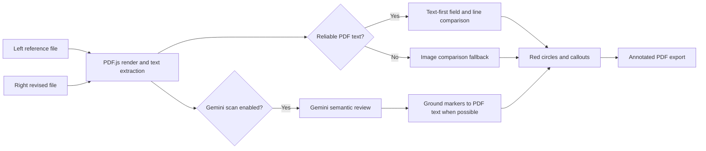

# LE PDF Scan

LE PDF Scan is an internal document-review tool for comparing two PDF documents or images. The current web application is focused on **Document Compare**. It runs in the browser, can optionally ask Gemini to review business-content changes, and exports one annotated PDF for follow-up work.

This README is written as a handoff guide. Read the **Current Status** section before changing code: the repository still contains a separate OpenCV Priority Count system, but that system is intentionally hidden from the current web UI.

## Current Status

| Workstream | Status | Where it runs | Main code |
| --- | --- | --- | --- |
| Document Compare | Active in the web UI | Browser + optional Vercel serverless Gemini proxy | `src/documentCompare.js`, `src/pdfTextDiff.js`, `src/gemini.js` |
| Gemini semantic review | Optional checkbox in Document Compare | Browser calls `/api/gemini` on Vercel, or a user-entered key in the current browser session | `src/gemini.js`, `api/gemini.js` |
| Priority Count / colored-marker scan | Paused and not shown in the UI | Separate Python/FastAPI service | `src/priorityScan.js`, `server_scanner.py`, `scripts/` |

`src/main.js` imports only `createDocumentCompare(...)`. That is why the public page currently opens directly to Document Compare and no longer shows Priority Scan.

> `"private": true` in `package.json` only prevents accidental publishing to npm. It does **not** control whether the GitHub repository is private or public.

## What A User Does Today

1. Upload a **ต้นฉบับ** (reference) file on the left and an **ฉบับเปรียบเทียบ** (revised) file on the right. Supported inputs are PDF, PNG, JPG, and WEBP.
2. Select the pages to compare. All pages are selected initially. Click thumbnails, Shift-click a range, or enter a range such as `1,5-8`.
3. Set a comparison area for each document page if only part of a page matters. Each side has its own page picker, `< >` navigation, and eight crop handles. The copy button applies the current crop only to the selected pages of that same document.
4. Optionally enable **Gemini scan** for semantic review of documents that use different templates or layouts.
5. Review the list of differences and the annotated preview. Download **PDF ที่เปรียบเทียบแล้ว** to get one combined PDF containing the revised/right-hand pages in the selected comparison order.

## How Document Compare Works



### 1. Open and render input files

`src/documentCompare.js` uses PDF.js locally in the browser. PDF files are not uploaded to a Python scanner for Document Compare.

- PDF pages are rendered to canvases for previews and image fallback.
- For a PDF, PDF.js also exposes a text layer with each text fragment's coordinates.
- Images are treated as one-page documents and do not have an extractable PDF text layer.

### 2. Page pairing

The tool pairs only the pages the user selected:

- If the same number of pages is selected on both sides, it pairs them in order.
- If one side has one selected page, that page is compared with every selected page on the other side.
- Otherwise, the shorter selection is distributed in document order across the longer selection. This makes every selected page participate instead of silently dropping pages.

### 3. Comparison area (crop)

The crop region is stored separately by side and page. A crop on `ต้นฉบับ หน้า 2` never changes the crop on `ฉบับเปรียบเทียบ หน้า 2` or another page.

- Drag an empty area to create a crop.
- Drag inside an existing crop to move it.
- Use all eight handles: four corners and four edge midpoints.
- The dashed full-page region means no custom crop is applied.

The crop is used for comparison only. It does not alter the source document or the final PDF page size.

### 4. Text-first comparison

For PDFs with a reliable text layer, `src/pdfTextDiff.js` is the first source of truth for position and ordinary text differences.

The code:

- checks that both cropped regions contain enough readable text;
- treats garbled/invalid text as unreliable so Thai mojibake does not become authoritative;
- detects common item-table fields such as material code, description, unit price, and subtotal;
- falls back to line/block comparison when the document is not a recognized item table; and
- keeps the exact normalized coordinates of the revised/right-hand text fragment.

This is why text PDFs should be compared through their text layer instead of trying to infer individual characters from pixels.

### 5. Image fallback

When reliable PDF text is not available and Gemini is not selected, the app compares rendered page images.

The fallback aligns the two cropped canvases, measures local pixel changes, filters broad structural noise such as table borders, and keeps small connected regions that look like real content changes. This is useful for scanned PDFs and image files, but it is less precise than a good PDF text layer.

### 6. Gemini scan

Gemini is optional. It is intended for semantic comparison when two documents have different layouts but represent the same business content, for example a quotation versus a purchase order.

`src/gemini.js` sends the selected reference and revised areas to `gemini-3.1-flash-lite` together with candidate text differences when they are available. Gemini returns a clean Thai summary and a list of changes containing reference/revised values. It is asked for one small normalized box per changed field when it is confident.

Gemini decides **what changed**. Marker placement uses the most reliable location available:

1. If the PDF text layer contains a matching reference/revised change, the app grounds the Gemini finding to that exact right-hand PDF text box.
2. If the matching text cannot be found, such as a scanned image or a non-extractable field, it falls back to Gemini's estimated image box.

This hybrid approach keeps Gemini's broader semantic coverage without letting approximate image coordinates shift circles away from the real text. The implementation is in `groundGeminiBoxesToPdfText(...)` in `src/documentCompare.js`.

### 7. Red circles, descriptions, and PDF export

Each confirmed finding is drawn as a red ellipse with a numbered badge. The corresponding explanation is placed back on the PDF page with a leader line.

Callout placement is deliberate, not random. The renderer samples ink density from the page image, avoids red-marker areas, avoids previously placed callouts, and scores candidate positions around the finding and across the page. It therefore prefers open/white areas. It is still a visual heuristic: on a dense page with no empty area large enough for a card, it chooses the least crowded valid position.

The export process uses `pdf-lib`:

- it copies the original revised/right-hand PDF pages at their original dimensions;
- it draws a transparent PNG annotation layer on top;
- it preserves the underlying document content for later editing; and
- it exports one combined `document-comparison.pdf` for all compared page pairs.

## Priority Count: Present in the Repository, Paused in the Web UI

Priority Count was built to rank PDF pages by the number of colored priority markers. It is **not deleted**. It is intentionally paused because it needs a long-running Python/OpenCV service and is not part of the current Vercel-only Document Compare release.

### What the priority system does

1. `server_scanner.py` receives a PDF and creates a background job.
2. `scripts/apply_red_box_calibration.py` renders pages with `pypdfium2` and asks `scripts/detector_features.py` to calculate OpenCV detector features.
3. The detector measures color-mask, connected-component, marker-area, and related page features for the requested color.
4. `model/detector_count_estimator.joblib` predicts a count from detector features. The current supported colors are red, green, blue, pink, and orange marker.
5. The service sorts pages by predicted count and produces a sorted PDF plus CSV.

### Source truth and calibration

`countedvalues.txt` is the human-counted source-truth dataset used during calibration. It covers the historical page range `1019-1115` (97 pages). It is training/evaluation data, not a page-number answer lookup.

The production scan path uses detector features and the tree-ensemble estimator in `model/detector_count_estimator.joblib`. The scanner code explicitly documents that it does not use page IDs, page-to-answer lookup, or an exact-coefficient fallback. `model/red_box_calibration_model.json` stores detector/calibration metadata used by the pipeline.

Useful training and evaluation scripts:

| Script | Purpose |
| --- | --- |
| `scripts/create_text_anchored_source_truth.py` | Builds source-truth data with text anchors. |
| `scripts/train_detector_count_estimator.py` | Trains the detector-feature count estimator. |
| `scripts/evaluate_counts_against_truth.py` | Compares predictions with the human counts. |
| `scripts/evaluate_detector_robustness.py` | Checks detector behavior against broader inputs. |
| `scripts/tune_detector_generalization.py` | Tunes generalization without page-answer lookup. |

Do not casually overwrite the files in `model/`. Train and evaluate first, then record the outcome before replacing a model artifact.

### Why Priority Count cannot run on Vercel as-is

The Priority Count path needs Python, OpenCV, `pypdfium2`, model files, PDF rendering, job polling, and more CPU/RAM than a small Vercel function is intended to provide. It should remain a separate Python service.

`render.yaml` is a starter Render configuration for that service. The API exposes:

- `POST /api/pdf-info`
- `POST /api/scan-job`
- `GET /api/jobs/{job_id}`
- `GET /api/download/{job_id}/{file_name}`
- `GET /api/health`

To enable Priority Count in the future:

1. Deploy `server_scanner.py` with `requirements.txt` to Render or another Python-capable host.
2. Set `VITE_SCANNER_API_URL` to that service URL at frontend build time.
3. Reintroduce `createPriorityScanner(...)` from `src/priorityScan.js` in `src/main.js` and add a deliberate UI entry point.
4. Test both the API job flow and progress polling before exposing it to users.

## Repository Map

```text
api/
  gemini.js                    Vercel serverless proxy for Gemini
model/
  detector_count_estimator.joblib
  red_box_calibration_model.json
scripts/                      Priority Count calibration and evaluation tools
src/
  main.js                     Current app entry point; Document Compare only
  documentCompare.js          UI, PDF rendering, comparison, annotations, export
  pdfTextDiff.js              Text-layer extraction, reliability checks, text diff
  gemini.js                   Browser-side Gemini request and response parsing
  priorityScan.js             Paused Priority Count frontend
  styles.css                  Shared UI styles
server_scanner.py             Paused Priority Count FastAPI service
render.yaml                   Render deployment template for the Python service
vercel.json                   Vite build and Gemini function settings
```

## Run Locally

### Document Compare only

This is the normal local workflow. It needs Node.js only.

```powershell
npm install
npm run dev
```

Open `http://127.0.0.1:5173`.

Build the production bundle before committing or deploying:

```powershell
npm run build
```

### Optional local Priority Count service

Only do this when working on the paused Python scanner.

```powershell
py -m venv .venv
.\.venv\Scripts\Activate.ps1
pip install -r requirements.txt
uvicorn server_scanner:app --host 127.0.0.1 --port 8000
```

In a second terminal, set the Vite variable before starting the frontend:

```powershell
$env:VITE_SCANNER_API_URL = "http://127.0.0.1:8000"
npm run dev
```

## Vercel Deployment

### What Vercel hosts

Vercel hosts:

- the Vite frontend in `dist/`; and
- `api/gemini.js` as the `/api/gemini` serverless endpoint.

Vercel does **not** host the OpenCV/Python Priority Count service in the current design.

`vercel.json` sets `npm run build`, publishes `dist`, and gives the Gemini function a 30-second maximum duration. Smaller selected areas reduce the size of the Gemini request and help keep requests within that limit.

### Connect GitHub to Vercel

1. In Vercel, choose **Add New -> Project**.
2. Import the GitHub repository `Conthium/le-pdfscan`.
3. Use the repository root as the project root. Vercel detects Vite from `package.json` and `vercel.json`.
4. Add the environment variables below.
5. Deploy. Future pushes to the connected branch create deployments automatically.

The project can also be deployed manually from this folder:

```powershell
vercel link
vercel --prod
```

### Gemini environment variables

Use this server-side Vercel variable for the proxy:

```text
GEMINI_API_KEY=your_gemini_api_key
```

Never commit an `.env` file or an API key. `.env` is ignored by Git.

`VITE_GEMINI_API_KEY` is supported for temporary browser-side use, but Vite bundles every `VITE_*` variable into public JavaScript. **Do not set `VITE_GEMINI_API_KEY` for a public repository or public Vercel deployment.**

The key field in the web UI is optional and is kept in browser `sessionStorage` for the current tab/session. When the field is empty, the app uses the Vercel `/api/gemini` proxy instead.

### Important security note for a public deployment

Keeping `GEMINI_API_KEY` in Vercel protects the key value from the source repository, but the current `/api/gemini` endpoint has no user authentication or rate limiting. If the deployed URL is open to everyone, visitors can consume the Gemini quota through that endpoint.

Before adding a shared server key to a public-facing deployment, add one of these controls:

- Vercel Deployment Protection or another access gate;
- application login/authorization;
- rate limiting and request-size limits; or
- require each user to enter their own API key.

## Public Repository Checklist

Before changing GitHub visibility to public, verify:

- no API key, `.env`, customer PDF, exported PDF, CSV, or debug file is committed;
- the repo does not contain proprietary client documents;
- `GEMINI_API_KEY` exists only in Vercel Environment Variables, never in Git; and
- `VITE_GEMINI_API_KEY` is unset for any public build.

Useful checks:

```powershell
git status --short
git grep -n "AIza" HEAD
vercel env ls
npm run build
```

## Handoff Checklist

1. Start with Document Compare. It is the only supported feature in the current UI.
2. Preserve the text-first rule: use PDF text when it is reliable; reserve pixel comparison for scans or bad text extraction.
3. Keep Gemini semantic findings and PDF-text marker grounding together. Do not revert to drawing raw Gemini boxes for text PDFs.
4. Treat Priority Count as a separate service project. Do not add its Python/OpenCV runtime back into Vercel.
5. Before every release, run `npm run build`, test a PDF pair locally, then test the deployed URL.
