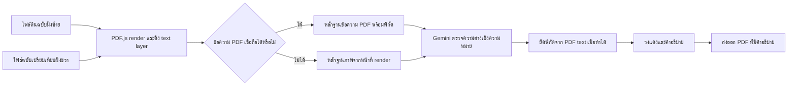

# LE PDF Scan

ภาษาไทย (หน้านี้) | [English](README.en.md)

LE PDF Scan คือเครื่องมือภายในสำหรับเปรียบเทียบเอกสาร PDF หรือรูปภาพสองฉบับ เว็บแอปในปัจจุบันเน้นฟีเจอร์ **Document Compare** ซึ่งทำงานในเบราว์เซอร์ สามารถใช้ Gemini ช่วยตรวจสอบความต่างเชิงเนื้อหา และส่งออกเป็น PDF ที่ใส่คำอธิบายไว้แล้วเพื่อนำไปทำงานต่อได้

เอกสารนี้เขียนขึ้นเพื่อส่งต่องานให้ผู้ดูแลคนถัดไป โปรดอ่านหัวข้อ **สถานะปัจจุบัน** ก่อนแก้โค้ด เพราะใน repository ยังมีระบบ OpenCV Priority Count อยู่ แต่ตั้งใจซ่อนไว้จากหน้าเว็บปัจจุบัน

## สถานะปัจจุบัน

| ส่วนงาน | สถานะ | ทำงานที่ใด | โค้ดหลัก |
| --- | --- | --- | --- |
| Document Compare | ใช้งานอยู่บนหน้าเว็บ | เบราว์เซอร์ + เรียก Gemini โดยตรงด้วย key ของผู้ใช้ | `src/documentCompare.js`, `src/pdfTextDiff.js`, `src/gemini.js` |
| Gemini semantic review | ต้องใช้เพื่อเปรียบเทียบเอกสาร | เบราว์เซอร์เรียก Gemini โดยตรงด้วย key ที่ผู้ใช้กรอก ไม่มี server proxy หรือ key ใน build | `src/gemini.js` |
| Priority Count / การสแกน marker สี | พักไว้และไม่แสดงใน UI | Python/FastAPI service แยกต่างหาก | `src/priorityScan.js`, `server_scanner.py`, `scripts/` |

`src/main.js` import เพียง `createDocumentCompare(...)` เท่านั้น นี่คือเหตุผลที่หน้าเว็บเปิดมาที่ Document Compare โดยตรงและไม่มี Priority Scan แล้ว

> ค่า `"private": true` ใน `package.json` มีหน้าที่ป้องกันการ publish package ไป npm โดยไม่ตั้งใจเท่านั้น ไม่ได้กำหนดว่า GitHub repository จะเป็น private หรือ public

## วิธีใช้สำหรับผู้ใช้งานปัจจุบัน

1. อัปโหลดไฟล์ **ต้นฉบับ** (reference) ทางซ้าย และ **ฉบับเปรียบเทียบ** (revised) ทางขวา รองรับ PDF, PNG, JPG และ WEBP
2. เลือกหน้าที่ต้องการเทียบ ระบบเลือกทุกหน้าไว้ก่อนเสมอ สามารถคลิก thumbnail, กด Shift-click เพื่อเลือกช่วง หรือพิมพ์ช่วง เช่น `1,5-8`
3. หากต้องการเทียบเพียงบางบริเวณ ให้กำหนดพื้นที่เปรียบเทียบของแต่ละหน้าได้ ฝั่งซ้ายและขวามีตัวเลือกหน้า, ปุ่ม `< >` และกรอบครอป 8 จุดจับของตัวเอง ปุ่มคัดลอกจะคัดลอกกรอบไปยังหน้าที่เลือกของเอกสารฝั่งเดียวกันเท่านั้น บนอุปกรณ์ touch ระบบจะเริ่มในโหมดเลื่อนหน้า ให้กดปุ่ม Crop ของฝั่งที่ต้องการก่อนแก้ไข จุดสัมผัสของ handle จะใหญ่กว่าขนาดที่มองเห็น และปุ่มรีเซ็ตที่อยู่ติดกันจะ disabled จนกว่าจะมีการ crop จริง
4. เลือก **สแกนเฉพาะสาระสำคัญ** หรือ **สแกนทั้งหมด** จากตัวเลือกขนาดกะทัดรัดบน header ของ Document Compare โหมดเฉพาะสาระสำคัญมี prompt ภาษาไทยที่แก้ได้และข้อความผู้ใช้จะเป็นนโยบายขอบเขตหลัก ส่วนโหมดทั้งหมดจะล็อกนโยบายตรวจครบไว้ ช่องเดียวกันจะเปลี่ยนเป็นบริบทเอกสารที่ไม่บังคับ ใช้อธิบายประเภทเอกสาร การจับคู่ field คำศัพท์ หน่วย หรือรูปแบบที่มีความหมายเท่ากันเท่านั้น prompt ของ focused และบริบทของ exhaustive ถูกเก็บแยกกันและไม่เขียนทับกัน
5. กดปุ่ม **Gemini** ที่มุมขวาบน แล้วกรอก API key ในหน้าต่างตั้งค่าและกดบันทึก ระบบจะซ่อนค่าและเก็บไว้ใน `localStorage` ของ browser นั้น ไม่เขียนลง repository และไม่ส่งเข้า server ของแอป
6. อ่านรายการความต่างและ preview ที่วงสีแดง จากนั้นกด **ดาวน์โหลด** เพื่อดาวน์โหลด PDF รวมของหน้าในฉบับเปรียบเทียบ/ฝั่งขวาตามลำดับคู่หน้าที่เลือก
7. ใช้ bottom dock ด้านล่างของพื้นที่ Document Compare เพื่อแก้ Prompt, เริ่มเปรียบเทียบ และดาวน์โหลดผลลัพธ์ได้ตลอดระหว่างการเลื่อนเอกสาร ตัว dock จำกัดความกว้างบน desktop และใช้พื้นที่เต็มจอบนหน้าจอแคบ โดยวางซ้อนอยู่ใน workspace เดียวกับเอกสารจึงยังเห็นเนื้อหาด้านหลังบริเวณข้าง dock

ขณะกำลังประมวลผล พื้นที่หัวของ Prompt จะเปลี่ยนเป็น progress ของคู่หน้าปัจจุบัน และปุ่มคืนค่า Prompt จะเปลี่ยนเป็นปุ่ม X สำหรับยกเลิก การกดลูกศรของ Prompt จะขยายหรือย่อกล่องเดิมแบบ inline ไม่เปิดหน้าต่างใหม่ และการกดดาวน์โหลดจะแสดง progress แยกจาก progress การเปรียบเทียบ

## Document Compare ทำงานอย่างไร



### 1. เปิดและ render ไฟล์

`src/documentCompare.js` ใช้ PDF.js ในเบราว์เซอร์โดยตรง ไฟล์ PDF ของ Document Compare จะไม่ถูกส่งไปที่ Python scanner

- หน้า PDF ถูก render เป็น canvas เพื่อใช้ preview และใช้เทียบภาพเมื่อจำเป็น
- สำหรับ PDF, PDF.js จะเปิดเผย text layer พร้อมพิกัดของข้อความแต่ละส่วน
- ไฟล์รูปภาพถูกมองเป็นเอกสารหนึ่งหน้า และไม่มี PDF text layer ให้ดึง

### 2. การจับคู่หน้า

ระบบจะจับคู่เฉพาะหน้าที่ผู้ใช้เลือก:

- ถ้าเลือกจำนวนหน้าเท่ากันทั้งสองฝั่ง จะจับคู่ตามลำดับ
- ถ้าฝั่งหนึ่งเลือกเพียงหน้าเดียว หน้านั้นจะถูกเทียบกับทุกหน้าที่เลือกของอีกฝั่ง
- กรณีอื่น ระบบจะกระจายหน้าจากรายการที่สั้นกว่าไปตามลำดับของรายการที่ยาวกว่า เพื่อให้ทุกหน้าที่เลือกถูกนำไปใช้ ไม่ใช่ถูกทิ้งเงียบ ๆ

### 3. พื้นที่เปรียบเทียบ (crop)

กรอบครอปถูกเก็บแยกตามฝั่งและเลขหน้า ดังนั้นกรอบของ `ต้นฉบับ หน้า 2` จะไม่เปลี่ยนกรอบของ `ฉบับเปรียบเทียบ หน้า 2` หรือหน้าอื่น

- กดปุ่ม Crop ของเอกสารฝั่งนั้นก่อนจึงจะแก้ไขได้ ทั้ง desktop และ touch ใช้กติกาเดียวกัน การคลิกบน preview ขณะที่ปุ่มยังไม่ active จะไม่สร้างกรอบใหม่
- ลากบนพื้นที่ว่างเพื่อสร้างกรอบครอป
- ลากภายในกรอบที่มีอยู่เพื่อย้ายกรอบ
- ปรับได้จากจุดจับ 8 ทิศ: มุม 4 จุด และกึ่งกลางขอบ 4 จุด
- บน touch ให้เลื่อนหน้าได้ตามปกติโดยไม่สร้างกรอบโดยไม่ตั้งใจ กดปุ่ม Crop เพื่อเข้าโหมดแก้ไข และกดปุ่มเดิมอีกครั้งเพื่อจบโหมดแก้ไข
- ปุ่มรีเซ็ตที่อยู่ติดกับ Crop จะคืนหน้าปัจจุบันกลับไปใช้ทั้งหน้า และจะ disabled เมื่อยังไม่มี crop เฉพาะหน้า
- กรอบเส้นประเต็มหน้าหมายถึงยังไม่ได้กำหนด crop เฉพาะหน้า

Crop ใช้เฉพาะตอนเปรียบเทียบ ไม่แก้ไขไฟล์ต้นฉบับและไม่เปลี่ยนขนาดหน้าของ PDF ที่ export

### 4. หลักฐานจาก text layer

สำหรับ PDF ที่มี text layer เชื่อถือได้ `src/pdfTextDiff.js` จะดึงข้อความที่อ่านได้ทั้งหมดในพื้นที่ที่เลือกพร้อมพิกัด normalized แล้วส่งให้ Gemini เป็นหลักฐาน ไม่ใช่คำตอบที่คำนวณไว้ล่วงหน้า

โค้ดจะ:

- เก็บเฉพาะ fragment ที่อ่านได้และตัด mojibake ที่เห็นชัด เพื่อไม่ให้ encoding ภาษาไทยที่เสียกลายเป็นข้อมูลหลัก
- รวม fragment เป็นบรรทัดพร้อมพิกัด normalized ที่คงที่
- ส่งหลักฐานข้อความครบทั้งสองฝั่งให้ Gemini โดยไม่ส่งรายการความต่างที่ local detector เดาไว้
- ค้นหาข้อความที่ Gemini ยืนยันแล้วกลับไปยัง text layer ของ PDF ฝั่งขวาเพื่อวางวงให้แม่นยำ

นี่คือเหตุผลที่ PDF ที่ extract text ได้ควรถูกเทียบผ่าน text layer ไม่ใช่เดาตัวอักษรแต่ละตัวจากภาพ

### 5. Image fallback

หาก PDF ไม่มีข้อความที่เชื่อถือได้ ระบบจะส่งภาพหน้าที่ render ให้ Gemini โดยใช้ภาพเป็นหลักฐานหลักสำหรับ PDF ที่สแกนมาและไฟล์รูปภาพ

Gemini จะถูกกำชับให้ละเว้น layout ความเอียงของการสแกน compression artifact และโครงสร้างภาพที่ไม่ใช่สาระ เว้นแต่สิ่งนั้นจะเป็นเนื้อหาทางธุรกิจจริง ผลลัพธ์จึงเป็นการตัดสินเชิงความหมาย ไม่ใช่รายการ pixel diff ดิบ

### 6. Gemini scan

Gemini เป็นตัวตรวจจับเชิงความหมายหลัก ใช้สำหรับเทียบความหมายของเนื้อหาเมื่อเอกสารสองฉบับใช้ template หรือ layout คนละแบบ แต่สื่อถึงงานเดียวกัน เช่น quotation เทียบกับ purchase order

`src/gemini.js` ส่งพื้นที่ที่เลือกของต้นฉบับและฉบับเปรียบเทียบไปที่ `gemini-3.1-flash-lite` พร้อมหลักฐานข้อความที่ extract ได้ทั้งหมด ในโหมด `focused` prompt ภาษาไทยที่ผู้ใช้แก้เป็นนโยบายหลักสำหรับสิ่งที่จะตรวจ รายงาน ละเว้น และถือว่าสำคัญ ส่วนโหมด `exhaustive` จะส่งนโยบายทุกความต่างที่แอปล็อกไว้เสมอ ข้อความเสริมจากผู้ใช้จะอยู่ในบล็อก `USER DOCUMENT CONTEXT` แยกต่างหาก ใช้ช่วยจับคู่ความหมายได้แต่ลดขอบเขตหรือสั่งไม่ให้รายงานความต่างที่มีหลักฐานไม่ได้ หากมี crop ทั้งภาพและ text evidence จะถูกจำกัดอยู่ใน crop นั้น prompt จะระบุ crop เป็นขอบเขตบังคับ และระบบจะตัดกล่องผลลัพธ์ให้อยู่ในพื้นที่ crop เสมอ Fixed instruction ยังคงบังคับให้ตอบจากหลักฐาน แยกคำสั่งในเอกสารออกจากคำสั่งผู้ใช้ ส่ง JSON ที่ถูกต้อง และระบุตำแหน่งที่อ้างอิงได้

เส้นทางปกติเรียก Gemini **หนึ่งคำขอต่อหนึ่งคู่หน้า** ภาพ หลักฐานข้อความจาก PDF และ bounded text candidates จะถูกประกอบและส่งเพียงครั้งเดียว โดยให้คำขอเดียวกันทำทั้งการจับคู่ ตรวจสาระสำคัญ รวมรายการซ้ำ และทบทวนคำตอบขั้นสุดท้าย คำขอจะทำงานใน `src/geminiWorker.js` ซึ่งช่วยให้ผู้ใช้สลับไปแท็บอื่นได้ระหว่างรอผล ระบบจะเรียกครั้งที่สองเฉพาะกรณี JSON ที่ตอบกลับมาเสียรูปและต้องกู้คืนเท่านั้น ระยะเวลาของ Gemini และเครือข่ายยังแปรผันได้ แต่ถ้าปิดหรือ reload หน้าเว็บ งานที่ผูกกับ browser นั้นจะถูกยกเลิก

เพราะระบบส่งทีละคู่หน้า จึงไม่มีการส่ง PDF ทั้งไฟล์ไป Gemini ใน request เดียว และจำนวนคู่หน้าที่สแกนได้จริงขึ้นกับโควตา API ของ Google, เวลาในการประมวลผล, ขนาด payload ของภาพ และหน่วยความจำของ browser มากกว่าจำนวนหน้าตามทฤษฎีของโมเดล หากเอกสารมีหลายร้อยหน้า ควรแบ่งช่วงหน้าและตรวจผลเป็นช่วง ๆ เพื่อให้ติดตามหรือเริ่มต่อได้ง่าย

Gemini เป็นผู้ตัดสินว่า **อะไรต่างกัน** แต่การวางวงแดงจะใช้ตำแหน่งที่น่าเชื่อถือที่สุดตามลำดับนี้:

1. ถ้า text layer ของ PDF พบความต่างที่ตรงกับค่า reference/revised ของ Gemini ระบบจะยึดกล่องข้อความจริงใน PDF ฝั่งขวา
2. ถ้าหาข้อความที่ตรงกันไม่ได้ เช่น เป็นภาพสแกนหรือเป็นฟิลด์ที่ extract ไม่ได้ ระบบจึง fallback ไปใช้กล่องจากภาพที่ Gemini ประเมิน

วิธีผสมนี้ทำให้ได้ความครอบคลุมเชิงความหมายจาก Gemini โดยไม่ปล่อยให้พิกัดจากภาพที่คลาดเคลื่อนเลื่อนวงแดงออกจากข้อความจริง การทำงานอยู่ใน `groundGeminiBoxesToPdfText(...)` ภายใน `src/documentCompare.js`

### 7. ผลลัพธ์และ preview เต็มจอ

ผลลัพธ์จะแสดงทุกคู่หน้าที่ผู้ใช้เลือก ไม่ว่าจะพบหรือไม่พบความต่าง ตารางจะบอกจำนวนจุดต่างและเปิดให้เลือกคู่หน้าเพื่อดูภาพที่มี annotation

- ปุ่มดูเต็มจอจะซ่อน bottom dock ชั่วคราว เพื่อให้เห็นเอกสารและแถบควบคุมได้ชัดเจน
- ที่ระดับ `100%` ระบบจะ fit ให้เห็นเอกสารทั้งแผ่นในแกนกว้างและสูง ไม่ใช่ขยายให้เต็มเฉพาะความยาวด้านใดด้านหนึ่ง
- ผู้ใช้สามารถซูมออก ซูมกลับค่าเริ่มต้น และซูมเข้าได้ รวมถึงเลื่อนดูเอกสารเมื่อซูมเกินขนาดที่พอดีหน้าจอ
- แถบควบคุม fullscreen มีปุ่มออกจากเต็มจอทั้งบน desktop และ mobile

### 8. วงแดง, คำอธิบาย และ PDF export

ทุก finding ที่ยืนยันแล้วจะถูกวาดเป็นวงรีสีแดงพร้อม badge หมายเลข คำอธิบายของหมายเลขนั้นถูกวางกลับลงบนหน้า PDF พร้อมเส้น leader line

การวางคำอธิบายไม่ใช่การสุ่ม ตัว renderer จะสุ่มตัวอย่างความหนาแน่นของหมึกจากภาพหน้าเอกสาร หลีกพื้นที่วงแดง หลีกกล่องคำอธิบายที่วางแล้ว และให้คะแนนตำแหน่งที่เป็นไปได้รอบ finding และทั่วหน้า จึงพยายามเลือกพื้นที่ขาว/โล่งก่อน อย่างไรก็ตาม นี่ยังเป็น heuristic จากภาพ: ถ้าหน้าแน่นจนไม่มีที่ว่างขนาดพอสำหรับกล่อง ระบบจะเลือกตำแหน่งที่แออัดน้อยที่สุดที่ยังวางได้

ขั้นตอน export ใช้ `pdf-lib`:

- คัดลอกหน้า PDF ต้นฉบับของฉบับเปรียบเทียบ/ฝั่งขวาด้วยขนาดเดิม
- วาง transparent PNG annotation layer ทับด้านบน
- คงเนื้อหาเอกสารเดิมไว้เพื่อให้แก้ไขต่อใน PDF editor ได้
- ส่งออก `document-comparison.pdf` ไฟล์เดียวสำหรับทุกคู่หน้าที่เทียบ

## Priority Count: มีอยู่ใน Repository แต่พักไว้จากหน้าเว็บ

Priority Count ถูกสร้างมาเพื่อจัดอันดับหน้า PDF ตามจำนวน marker สีของ priority ระบบนี้ **ไม่ได้ถูกลบ** แต่ตั้งใจพักไว้ เพราะต้องใช้ Python/OpenCV service ที่ทำงานนาน และไม่ใช่ส่วนของ Document Compare ที่ deploy บน Vercel อย่างเดียวในตอนนี้

### ระบบ Priority Count ทำอะไรบ้าง

1. `server_scanner.py` รับ PDF และสร้าง background job
2. `scripts/apply_red_box_calibration.py` render หน้าเอกสารด้วย `pypdfium2` แล้วเรียก `scripts/detector_features.py` เพื่อคำนวณ OpenCV detector features
3. detector วัด color mask, connected component, marker area และ feature อื่นของหน้าตามสีที่เลือก
4. `model/detector_count_estimator.joblib` ทำนายจำนวนจาก detector features ปัจจุบันรองรับ red, green, blue, pink และ orange marker
5. service เรียงหน้าตามจำนวนที่ทำนาย แล้วสร้าง PDF ที่เรียงแล้วกับ CSV

### Source truth และ calibration

`countedvalues.txt` คือชุดข้อมูล source truth ที่มนุษย์นับไว้ ใช้สำหรับ calibration โดยครอบคลุมช่วงหน้าในอดีต `1019-1115` รวม 97 หน้า ข้อมูลนี้เป็น training/evaluation data ไม่ใช่การ lookup คำตอบจากเลขหน้า

เส้นทางสแกน production ใช้ detector features และ tree-ensemble estimator ใน `model/detector_count_estimator.joblib` โค้ด scanner ระบุชัดว่าไม่ใช้ page ID, page-to-answer lookup หรือ exact-coefficient fallback ไฟล์ `model/red_box_calibration_model.json` เก็บ metadata ของ detector/calibration ที่ pipeline ใช้

script ที่สำคัญสำหรับ training และประเมินผล:

| Script | หน้าที่ |
| --- | --- |
| `scripts/create_text_anchored_source_truth.py` | สร้าง source truth ที่มี text anchor |
| `scripts/train_detector_count_estimator.py` | train detector-feature count estimator |
| `scripts/evaluate_counts_against_truth.py` | เปรียบเทียบ prediction กับจำนวนที่มนุษย์นับ |
| `scripts/evaluate_detector_robustness.py` | ตรวจพฤติกรรมของ detector กับ input ที่กว้างขึ้น |
| `scripts/tune_detector_generalization.py` | ปรับ generalization โดยไม่ใช้ page-answer lookup |

อย่าเขียนทับไฟล์ใน `model/` โดยไม่ตั้งใจ ควร train และประเมินผลก่อน จากนั้นบันทึกผลก่อนแทนที่ model artifact

### เหตุผลที่ Priority Count ไม่ควรรันบน Vercel ในรูปแบบปัจจุบัน

เส้นทาง Priority Count ต้องใช้ Python, OpenCV, `pypdfium2`, model files, การ render PDF, job polling และ CPU/RAM มากกว่า Vercel function ขนาดเล็กที่เหมาะสม จึงควรคงไว้เป็น Python service แยกต่างหาก

`render.yaml` เป็น template เริ่มต้นสำหรับ deploy service นี้บน Render โดย API มี endpoint:

- `POST /api/pdf-info`
- `POST /api/scan-job`
- `GET /api/jobs/{job_id}`
- `GET /api/download/{job_id}/{file_name}`
- `GET /api/health`

หากต้องการเปิด Priority Count อีกครั้งในอนาคต:

1. Deploy `server_scanner.py` พร้อม `requirements.txt` บน Render หรือ host ที่รัน Python ได้
2. ตั้ง `VITE_SCANNER_API_URL` เป็น URL ของ service ตอน build frontend
3. นำ `createPriorityScanner(...)` จาก `src/priorityScan.js` กลับมา import ใน `src/main.js` และเพิ่ม UI entry point อย่างตั้งใจ
4. ทดสอบทั้ง API job flow และ progress polling ก่อนเปิดให้ผู้ใช้ใช้งาน

## แผนผัง Repository

```text
model/
  detector_count_estimator.joblib
  red_box_calibration_model.json
scripts/                      เครื่องมือ calibration/evaluation ของ Priority Count
src/
  main.js                     จุดเริ่มแอปปัจจุบัน; Document Compare เท่านั้น
  documentCompare.js          UI, PDF rendering, comparison, annotations, export
  pdfTextDiff.js              text-layer extraction, reliability checks, text diff
  gemini.js                   Gemini request/response parsing ฝั่งเบราว์เซอร์
  geminiWorker.js             worker สำหรับเรียก Gemini เบื้องหลัง
  priorityScan.js             frontend ของ Priority Count ที่พักไว้
  styles.css                  shared UI styles
server_scanner.py             FastAPI service ของ Priority Count ที่พักไว้
render.yaml                   template deploy Python service บน Render
vercel.json                   การตั้งค่า Vite build และ output
```

## การรันในเครื่อง

### Document Compare อย่างเดียว

นี่คือ workflow ปกติในปัจจุบัน ใช้ Node.js อย่างเดียว

```powershell
npm install
npm run dev
```

เปิด `http://127.0.0.1:5173`

ก่อน commit หรือ deploy ควร build production bundle:

```powershell
npm run build
```

### Priority Count service ในเครื่อง (ทางเลือก)

ทำเฉพาะเมื่อพัฒนาส่วน Python scanner ที่พักไว้

```powershell
py -m venv .venv
.\.venv\Scripts\Activate.ps1
pip install -r requirements.txt
uvicorn server_scanner:app --host 127.0.0.1 --port 8000
```

เปิด terminal ที่สอง แล้วตั้ง Vite variable ก่อนเริ่ม frontend:

```powershell
$env:VITE_SCANNER_API_URL = "http://127.0.0.1:8000"
npm run dev
```

## การ Deploy ด้วย Vercel

### Vercel host อะไรบ้าง

Vercel host:

- Vite frontend แบบ static ใน `dist/`

Vercel **ไม่ได้** host OpenCV/Python Priority Count service ใน design ปัจจุบัน

`vercel.json` ตั้งค่า `npm run build` และ publish `dist` เบราว์เซอร์จะเรียก Google Gemini โดยตรงหลังผู้ใช้กรอก key

### เชื่อม GitHub กับ Vercel

1. ใน Vercel เลือก **Add New -> Project**
2. Import GitHub repository `Conthium/le-pdfscan`
3. ใช้ repository root เป็น project root โดย Vercel จะตรวจพบ Vite จาก `package.json` และ `vercel.json`
4. Deploy จากนั้นทุก push ไปยัง branch ที่เชื่อมไว้จะสร้าง deployment ใหม่โดยอัตโนมัติ

สามารถ deploy จากโฟลเดอร์นี้ด้วย Vercel CLI ได้เช่นกัน:

```powershell
vercel link
vercel --prod
```

### การจัดการ Gemini key

ผู้ใช้กดปุ่ม **Gemini** ที่มุมขวาบน แล้วกรอก Gemini API key ในหน้าต่างตั้งค่า ระบบซ่อนค่าและเก็บไว้เฉพาะใน `localStorage` ของ browser นั้น จึงยังอยู่หลัง reload ได้ ค่า key ไม่อยู่ใน build, repository, Vercel environment หรือ log ของแอป และถูกส่งตรงไปยัง Google API

เพราะเป็น key ฝั่ง browser ควรสร้าง key ที่จำกัด API และจำกัด referrer หาก key ถูกนำไปวางใน chat, source code, screenshot หรือ deployment สาธารณะ ให้ revoke แล้วสร้างใหม่

## Checklist ก่อนเปิด Repository เป็น Public

ก่อนเปลี่ยน visibility ของ GitHub เป็น public ให้ตรวจ:

- ไม่มี API key, `.env`, PDF ลูกค้า, PDF ที่ export แล้ว, CSV หรือ debug file ถูก commit
- repository ไม่มีเอกสารลูกค้าหรือข้อมูลลับของบริษัท
- ไม่มี Gemini API key อยู่ใน source, `.env`, build output หรือ Git history

คำสั่งที่ช่วยตรวจ:

```powershell
git status --short
git grep -n "AIza" HEAD
vercel env ls
npm run build
```

## Checklist สำหรับผู้รับช่วง

1. เริ่มจาก Document Compare เพราะเป็นฟีเจอร์เดียวที่รองรับใน UI ปัจจุบัน
2. รักษากฎ text-first: ใช้ PDF text เมื่อเชื่อถือได้ และใช้ pixel comparison เฉพาะไฟล์สแกนหรือ text extraction ที่เสีย
3. รักษาการทำงานร่วมกันของ Gemini semantic findings กับ PDF-text marker grounding อย่าย้อนกลับไปวาด raw Gemini box สำหรับ PDF ที่ extract text ได้
4. มอง Priority Count เป็นโปรเจกต์ service แยก ห้ามย้าย Python/OpenCV runtime กลับไป Vercel
5. ก่อนปล่อยทุกครั้ง ให้รัน `npm run build`, ทดสอบ PDF หนึ่งคู่ในเครื่อง และทดสอบ URL ที่ deploy แล้ว
