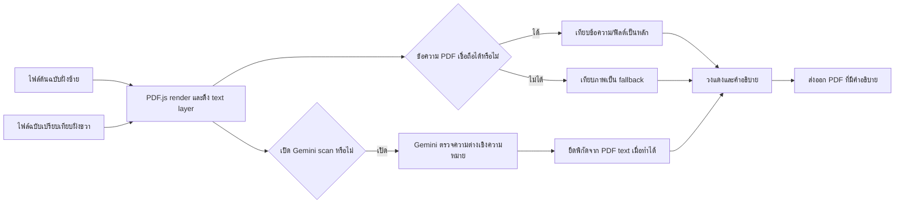

# LE PDF Scan

[English](README.md) | [ภาษาไทย](README.th.md)

LE PDF Scan คือเครื่องมือภายในสำหรับเปรียบเทียบเอกสาร PDF หรือรูปภาพสองฉบับ เว็บแอปในปัจจุบันเน้นฟีเจอร์ **Document Compare** ซึ่งทำงานในเบราว์เซอร์ สามารถใช้ Gemini ช่วยตรวจสอบความต่างเชิงเนื้อหา และส่งออกเป็น PDF ที่ใส่คำอธิบายไว้แล้วเพื่อนำไปทำงานต่อได้

เอกสารนี้เขียนขึ้นเพื่อส่งต่องานให้ผู้ดูแลคนถัดไป โปรดอ่านหัวข้อ **สถานะปัจจุบัน** ก่อนแก้โค้ด เพราะใน repository ยังมีระบบ OpenCV Priority Count อยู่ แต่ตั้งใจซ่อนไว้จากหน้าเว็บปัจจุบัน

## สถานะปัจจุบัน

| ส่วนงาน | สถานะ | ทำงานที่ใด | โค้ดหลัก |
| --- | --- | --- | --- |
| Document Compare | ใช้งานอยู่บนหน้าเว็บ | เบราว์เซอร์ + Vercel serverless Gemini proxy (ถ้าเปิดใช้) | `src/documentCompare.js`, `src/pdfTextDiff.js`, `src/gemini.js` |
| Gemini semantic review | เป็นตัวเลือกใน Document Compare | เบราว์เซอร์เรียก `/api/gemini` บน Vercel หรือใช้ key ที่ผู้ใช้กรอกใน session ปัจจุบัน | `src/gemini.js`, `api/gemini.js` |
| Priority Count / การสแกน marker สี | พักไว้และไม่แสดงใน UI | Python/FastAPI service แยกต่างหาก | `src/priorityScan.js`, `server_scanner.py`, `scripts/` |

`src/main.js` import เพียง `createDocumentCompare(...)` เท่านั้น นี่คือเหตุผลที่หน้าเว็บเปิดมาที่ Document Compare โดยตรงและไม่มี Priority Scan แล้ว

> ค่า `"private": true` ใน `package.json` มีหน้าที่ป้องกันการ publish package ไป npm โดยไม่ตั้งใจเท่านั้น ไม่ได้กำหนดว่า GitHub repository จะเป็น private หรือ public

## วิธีใช้สำหรับผู้ใช้งานปัจจุบัน

1. อัปโหลดไฟล์ **ต้นฉบับ** (reference) ทางซ้าย และ **ฉบับเปรียบเทียบ** (revised) ทางขวา รองรับ PDF, PNG, JPG และ WEBP
2. เลือกหน้าที่ต้องการเทียบ ระบบเลือกทุกหน้าไว้ก่อนเสมอ สามารถคลิก thumbnail, กด Shift-click เพื่อเลือกช่วง หรือพิมพ์ช่วง เช่น `1,5-8`
3. หากต้องการเทียบเพียงบางบริเวณ ให้กำหนดพื้นที่เปรียบเทียบของแต่ละหน้าได้ ฝั่งซ้ายและขวามีตัวเลือกหน้า, ปุ่ม `< >` และกรอบครอป 8 จุดจับของตัวเอง ปุ่มคัดลอกจะคัดลอกกรอบไปยังหน้าที่เลือกของเอกสารฝั่งเดียวกันเท่านั้น
4. เปิด **Gemini scan** เมื่อต้องการให้ Gemini ช่วยตรวจความต่างเชิงเนื้อหาของเอกสารที่ layout ต่างกัน
5. อ่านรายการความต่างและ preview ที่วงสีแดง จากนั้นกด **PDF ที่เปรียบเทียบแล้ว** เพื่อดาวน์โหลด PDF รวมของหน้าในฉบับเปรียบเทียบ/ฝั่งขวาตามลำดับคู่หน้าที่เลือก

## Document Compare ทำงานอย่างไร



### 1. เปิดและ render ไฟล์

`src/documentCompare.js` ใช้ PDF.js ในเบราว์เซอร์โดยตรง ไฟล์ PDF ของ Document Compare จะไม่ถูกส่งไปที่ Python scanner

- หน้า PDF ถูก render เป็น canvas เพื่อใช้ preview และใช้เทียบภาพเมื่อจำเป็น
- สำหรับ PDF, PDF.js จะเปิดเผย text layer พร้อมพิกัดของข้อความแต่ละส่วน
- ไฟล์รูปภาพถูกมองเป็นเอกสารหนึ่งหน้า และไม่มี PDF text layer ให้ดึง

### 2. การจับคู่หน้า

ระบบจะจับคู่เฉพาะหน้าที่ผู้ใช้เลือก:

- ถ้าเลือกจำนวนหน้าเท่ากันทั้งสองฝั่ง จะจับคู่ตามลำดับ
- ถ้าฝั่งหนึ่งเลือกเพียงหน้าเดียว หน้านั้นจะถูกเทียบกับทุกหน้าที่เลือกของอีกฝั่ง
- กรณีอื่น ระบบจะกระจายหน้าจากรายการที่สั้นกว่าไปตามลำดับของรายการที่ยาวกว่า เพื่อให้ทุกหน้าที่เลือกถูกนำไปใช้ ไม่ใช่ถูกทิ้งเงียบ ๆ

### 3. พื้นที่เปรียบเทียบ (crop)

กรอบครอปถูกเก็บแยกตามฝั่งและเลขหน้า ดังนั้นกรอบของ `ต้นฉบับ หน้า 2` จะไม่เปลี่ยนกรอบของ `ฉบับเปรียบเทียบ หน้า 2` หรือหน้าอื่น

- ลากบนพื้นที่ว่างเพื่อสร้างกรอบครอป
- ลากภายในกรอบที่มีอยู่เพื่อย้ายกรอบ
- ปรับได้จากจุดจับ 8 ทิศ: มุม 4 จุด และกึ่งกลางขอบ 4 จุด
- กรอบเส้นประเต็มหน้าหมายถึงยังไม่ได้กำหนด crop เฉพาะหน้า

Crop ใช้เฉพาะตอนเปรียบเทียบ ไม่แก้ไขไฟล์ต้นฉบับและไม่เปลี่ยนขนาดหน้าของ PDF ที่ export

### 4. การเทียบข้อความเป็นหลัก

สำหรับ PDF ที่มี text layer เชื่อถือได้ `src/pdfTextDiff.js` คือแหล่งอ้างอิงหลักสำหรับตำแหน่งและความต่างของข้อความทั่วไป

โค้ดจะ:

- ตรวจว่าทั้งสองพื้นที่ crop มีข้อความที่อ่านได้มากพอ
- มองข้อความที่เสียหรือไม่ถูกต้องเป็นข้อความที่ไม่น่าเชื่อถือ เพื่อไม่ให้ mojibake ภาษาไทยกลายเป็นข้อมูลหลัก
- ตรวจฟิลด์ของตารางรายการสินค้า เช่น material code, description, ราคาต่อหน่วย และ subtotal
- ถ้าไม่พบตารางรูปแบบที่รู้จัก จะ fallback ไปเทียบระดับบรรทัด/กลุ่มข้อความ
- เก็บพิกัด normalized ที่แม่นยำของข้อความในฉบับเปรียบเทียบ/ฝั่งขวา

นี่คือเหตุผลที่ PDF ที่ extract text ได้ควรถูกเทียบผ่าน text layer ไม่ใช่เดาตัวอักษรแต่ละตัวจากภาพ

### 5. Image fallback

หาก PDF ไม่มีข้อความที่เชื่อถือได้และไม่ได้เปิด Gemini ระบบจะเทียบ canvas ของหน้ากระดาษจากภาพ

Image fallback จะจัดแนว canvas ที่ crop แล้ว วัดความต่างของพิกเซลเฉพาะจุด กรอง noise เชิงโครงสร้าง เช่น เส้นตารางกว้าง ๆ และเก็บบริเวณเล็กที่มีลักษณะเป็นความต่างของเนื้อหาจริง วิธีนี้เหมาะกับ PDF ที่สแกนจากกระดาษและไฟล์รูปภาพ แต่แม่นยำน้อยกว่า text layer ที่ดี

### 6. Gemini scan

Gemini เป็นตัวเลือกเสริม ใช้สำหรับเทียบความหมายของเนื้อหาเมื่อเอกสารสองฉบับใช้ template หรือ layout คนละแบบ แต่สื่อถึงงานเดียวกัน เช่น quotation เทียบกับ purchase order

`src/gemini.js` ส่งพื้นที่ที่เลือกของต้นฉบับและฉบับเปรียบเทียบไปที่ `gemini-3.1-flash-lite` พร้อม candidate text differences เมื่อมี Gemini จะตอบกลับเป็นสรุปภาษาไทยที่อ่านง่ายและรายการความต่างซึ่งมีค่าในต้นฉบับ/ฉบับเปรียบเทียบ โดยจะระบุ bounding box ขนาดเล็กต่อฟิลด์เมื่อมั่นใจในตำแหน่ง

Gemini เป็นผู้ตัดสินว่า **อะไรต่างกัน** แต่การวางวงแดงจะใช้ตำแหน่งที่น่าเชื่อถือที่สุดตามลำดับนี้:

1. ถ้า text layer ของ PDF พบความต่างที่ตรงกับค่า reference/revised ของ Gemini ระบบจะยึดกล่องข้อความจริงใน PDF ฝั่งขวา
2. ถ้าหาข้อความที่ตรงกันไม่ได้ เช่น เป็นภาพสแกนหรือเป็นฟิลด์ที่ extract ไม่ได้ ระบบจึง fallback ไปใช้กล่องจากภาพที่ Gemini ประเมิน

วิธีผสมนี้ทำให้ได้ความครอบคลุมเชิงความหมายจาก Gemini โดยไม่ปล่อยให้พิกัดจากภาพที่คลาดเคลื่อนเลื่อนวงแดงออกจากข้อความจริง การทำงานอยู่ใน `groundGeminiBoxesToPdfText(...)` ภายใน `src/documentCompare.js`

### 7. วงแดง, คำอธิบาย และ PDF export

ทุก finding ที่ยืนยันแล้วจะถูกวาดเป็นวงรีสีแดงพร้อม badge หมายเลข คำอธิบายของหมายเลขนั้นถูกวางกลับลงบนหน้า PDF พร้อมเส้น leader line

การวางคำอธิบายไม่ใช่การสุ่ม ตัว renderer จะสุ่มตัวอย่างความหนาแน่นของหมึกจากภาพหน้าเอกสาร หลีกพื้นที่วงแดง หลีกกล่องคำอธิบายที่วางแล้ว และให้คะแนนตำแหน่งที่เป็นไปได้รอบ finding และทั่วหน้า จึงพยายามเลือกพื้นที่ขาว/โล่งก่อน อย่างไรก็ตาม นี่ยังเป็น heuristic จากภาพ: ถ้าหน้าแน่นจนไม่มีที่ว่างขนาดพอสำหรับกล่อง ระบบจะเลือกตำแหน่งที่แออัดน้อยที่สุดที่ยังวางได้

ขั้นตอน export ใช้ `pdf-lib`:

- คัดลอกหน้า PDF ต้นฉบับของฉบับเปรียบเทียบ/ฝั่งขวาด้วยขนาดเดิม
- วาง transparent PNG annotation layer ทับด้านบน
- คงเนื้อหาเอกสารเดิมไว้เพื่อให้แก้ไขต่อใน PDF editor ได้
- ส่งออก `document-comparison.pdf` ไฟล์เดียวสำหรับทุกคู่หน้าที่เทียบ

## Priority Count: มีอยู่ใน Repository แต่พักไว้จากหน้าเว็บ

Priority Count ถูกสร้างมาเพื่อจัดอันดับหน้า PDF ตามจำนวน marker สีของ priority ระบบนี้ **ไม่ได้ถูกลบ** แต่ตั้งใจพักไว้ เพราะต้องใช้ Python/OpenCV service ที่ทำงานนาน และไม่ใช่ส่วนของ Document Compare ที่ deploy บน Vercel อย่างเดียวในตอนนี้

### ระบบ Priority Count ทำอะไรบ้าง

1. `server_scanner.py` รับ PDF และสร้าง background job
2. `scripts/apply_red_box_calibration.py` render หน้าเอกสารด้วย `pypdfium2` แล้วเรียก `scripts/detector_features.py` เพื่อคำนวณ OpenCV detector features
3. detector วัด color mask, connected component, marker area และ feature อื่นของหน้าตามสีที่เลือก
4. `model/detector_count_estimator.joblib` ทำนายจำนวนจาก detector features ปัจจุบันรองรับ red, green, blue, pink และ orange marker
5. service เรียงหน้าตามจำนวนที่ทำนาย แล้วสร้าง PDF ที่เรียงแล้วกับ CSV

### Source truth และ calibration

`countedvalues.txt` คือชุดข้อมูล source truth ที่มนุษย์นับไว้ ใช้สำหรับ calibration โดยครอบคลุมช่วงหน้าในอดีต `1019-1115` รวม 97 หน้า ข้อมูลนี้เป็น training/evaluation data ไม่ใช่การ lookup คำตอบจากเลขหน้า

เส้นทางสแกน production ใช้ detector features และ tree-ensemble estimator ใน `model/detector_count_estimator.joblib` โค้ด scanner ระบุชัดว่าไม่ใช้ page ID, page-to-answer lookup หรือ exact-coefficient fallback ไฟล์ `model/red_box_calibration_model.json` เก็บ metadata ของ detector/calibration ที่ pipeline ใช้

script ที่สำคัญสำหรับ training และประเมินผล:

| Script | หน้าที่ |
| --- | --- |
| `scripts/create_text_anchored_source_truth.py` | สร้าง source truth ที่มี text anchor |
| `scripts/train_detector_count_estimator.py` | train detector-feature count estimator |
| `scripts/evaluate_counts_against_truth.py` | เปรียบเทียบ prediction กับจำนวนที่มนุษย์นับ |
| `scripts/evaluate_detector_robustness.py` | ตรวจพฤติกรรมของ detector กับ input ที่กว้างขึ้น |
| `scripts/tune_detector_generalization.py` | ปรับ generalization โดยไม่ใช้ page-answer lookup |

อย่าเขียนทับไฟล์ใน `model/` โดยไม่ตั้งใจ ควร train และประเมินผลก่อน จากนั้นบันทึกผลก่อนแทนที่ model artifact

### เหตุผลที่ Priority Count ไม่ควรรันบน Vercel ในรูปแบบปัจจุบัน

เส้นทาง Priority Count ต้องใช้ Python, OpenCV, `pypdfium2`, model files, การ render PDF, job polling และ CPU/RAM มากกว่า Vercel function ขนาดเล็กที่เหมาะสม จึงควรคงไว้เป็น Python service แยกต่างหาก

`render.yaml` เป็น template เริ่มต้นสำหรับ deploy service นี้บน Render โดย API มี endpoint:

- `POST /api/pdf-info`
- `POST /api/scan-job`
- `GET /api/jobs/{job_id}`
- `GET /api/download/{job_id}/{file_name}`
- `GET /api/health`

หากต้องการเปิด Priority Count อีกครั้งในอนาคต:

1. Deploy `server_scanner.py` พร้อม `requirements.txt` บน Render หรือ host ที่รัน Python ได้
2. ตั้ง `VITE_SCANNER_API_URL` เป็น URL ของ service ตอน build frontend
3. นำ `createPriorityScanner(...)` จาก `src/priorityScan.js` กลับมา import ใน `src/main.js` และเพิ่ม UI entry point อย่างตั้งใจ
4. ทดสอบทั้ง API job flow และ progress polling ก่อนเปิดให้ผู้ใช้ใช้งาน

## แผนผัง Repository

```text
api/
  gemini.js                    Vercel serverless proxy สำหรับ Gemini
model/
  detector_count_estimator.joblib
  red_box_calibration_model.json
scripts/                      เครื่องมือ calibration/evaluation ของ Priority Count
src/
  main.js                     จุดเริ่มแอปปัจจุบัน; Document Compare เท่านั้น
  documentCompare.js          UI, PDF rendering, comparison, annotations, export
  pdfTextDiff.js              text-layer extraction, reliability checks, text diff
  gemini.js                   Gemini request/response parsing ฝั่งเบราว์เซอร์
  priorityScan.js             frontend ของ Priority Count ที่พักไว้
  styles.css                  shared UI styles
server_scanner.py             FastAPI service ของ Priority Count ที่พักไว้
render.yaml                   template deploy Python service บน Render
vercel.json                   การตั้งค่า Vite build และ Gemini function
```

## การรันในเครื่อง

### Document Compare อย่างเดียว

นี่คือ workflow ปกติในปัจจุบัน ใช้ Node.js อย่างเดียว

```powershell
npm install
npm run dev
```

เปิด `http://127.0.0.1:5173`

ก่อน commit หรือ deploy ควร build production bundle:

```powershell
npm run build
```

### Priority Count service ในเครื่อง (ทางเลือก)

ทำเฉพาะเมื่อพัฒนาส่วน Python scanner ที่พักไว้

```powershell
py -m venv .venv
.\.venv\Scripts\Activate.ps1
pip install -r requirements.txt
uvicorn server_scanner:app --host 127.0.0.1 --port 8000
```

เปิด terminal ที่สอง แล้วตั้ง Vite variable ก่อนเริ่ม frontend:

```powershell
$env:VITE_SCANNER_API_URL = "http://127.0.0.1:8000"
npm run dev
```

## การ Deploy ด้วย Vercel

### Vercel host อะไรบ้าง

Vercel host:

- Vite frontend ใน `dist/`
- `api/gemini.js` เป็น serverless endpoint ที่ `/api/gemini`

Vercel **ไม่ได้** host OpenCV/Python Priority Count service ใน design ปัจจุบัน

`vercel.json` ตั้งค่า `npm run build`, publish `dist` และกำหนดให้ Gemini function มีเวลาทำงานสูงสุด 30 วินาที การเลือกพื้นที่เปรียบเทียบที่เล็กลงช่วยลดขนาด request ของ Gemini และช่วยให้เสร็จภายในเวลานี้

### เชื่อม GitHub กับ Vercel

1. ใน Vercel เลือก **Add New -> Project**
2. Import GitHub repository `Conthium/le-pdfscan`
3. ใช้ repository root เป็น project root โดย Vercel จะตรวจพบ Vite จาก `package.json` และ `vercel.json`
4. เพิ่ม environment variables ด้านล่าง
5. Deploy จากนั้นทุก push ไปยัง branch ที่เชื่อมไว้จะสร้าง deployment ใหม่โดยอัตโนมัติ

สามารถ deploy จากโฟลเดอร์นี้ด้วย Vercel CLI ได้เช่นกัน:

```powershell
vercel link
vercel --prod
```

### Gemini environment variables

ใช้ Vercel variable ฝั่ง server ตัวนี้สำหรับ proxy:

```text
GEMINI_API_KEY=your_gemini_api_key
```

ห้าม commit ไฟล์ `.env` หรือ API key โดย `.env` ถูก ignore จาก Git แล้ว

รองรับ `VITE_GEMINI_API_KEY` สำหรับกรณีชั่วคราวที่ต้องการใช้ key ในเบราว์เซอร์ แต่ Vite จะ bundle ทุกตัวแปรที่ขึ้นต้นด้วย `VITE_*` ลงใน JavaScript สาธารณะ ดังนั้น **ห้ามตั้ง `VITE_GEMINI_API_KEY` สำหรับ repository หรือ Vercel deployment ที่เป็น public**

ช่อง key บนหน้าเว็บเป็นทางเลือก Key จะถูกเก็บใน browser `sessionStorage` ของ tab/session ปัจจุบัน เมื่อปล่อยช่องว่าง แอปจะเรียก Vercel `/api/gemini` proxy แทน

### ข้อควรระวังสำหรับ public deployment

การเก็บ `GEMINI_API_KEY` ไว้บน Vercel ช่วยซ่อนค่า key จาก source repository แต่ `/api/gemini` ปัจจุบันยังไม่มีการยืนยันตัวตนหรือ rate limit หาก URL ที่ deploy เปิดให้ทุกคนใช้ ผู้เข้าชมอาจใช้ Gemini quota ผ่าน endpoint นี้ได้

ก่อนใส่ shared server key บน deployment ที่เปิดสาธารณะ ควรเพิ่มอย่างน้อยหนึ่งอย่างต่อไปนี้:

- Vercel Deployment Protection หรือ access gate อื่น
- login/authorization ในแอป
- rate limit และ request-size limit
- บังคับให้ผู้ใช้แต่ละคนกรอก API key ของตัวเอง

## Checklist ก่อนเปิด Repository เป็น Public

ก่อนเปลี่ยน visibility ของ GitHub เป็น public ให้ตรวจ:

- ไม่มี API key, `.env`, PDF ลูกค้า, PDF ที่ export แล้ว, CSV หรือ debug file ถูก commit
- repository ไม่มีเอกสารลูกค้าหรือข้อมูลลับของบริษัท
- `GEMINI_API_KEY` อยู่ใน Vercel Environment Variables เท่านั้น ไม่อยู่ใน Git
- `VITE_GEMINI_API_KEY` ไม่ได้ถูกตั้งสำหรับ public build

คำสั่งที่ช่วยตรวจ:

```powershell
git status --short
git grep -n "AIza" HEAD
vercel env ls
npm run build
```

## Checklist สำหรับผู้รับช่วง

1. เริ่มจาก Document Compare เพราะเป็นฟีเจอร์เดียวที่รองรับใน UI ปัจจุบัน
2. รักษากฎ text-first: ใช้ PDF text เมื่อเชื่อถือได้ และใช้ pixel comparison เฉพาะไฟล์สแกนหรือ text extraction ที่เสีย
3. รักษาการทำงานร่วมกันของ Gemini semantic findings กับ PDF-text marker grounding อย่าย้อนกลับไปวาด raw Gemini box สำหรับ PDF ที่ extract text ได้
4. มอง Priority Count เป็นโปรเจกต์ service แยก ห้ามย้าย Python/OpenCV runtime กลับไป Vercel
5. ก่อนปล่อยทุกครั้ง ให้รัน `npm run build`, ทดสอบ PDF หนึ่งคู่ในเครื่อง และทดสอบ URL ที่ deploy แล้ว
